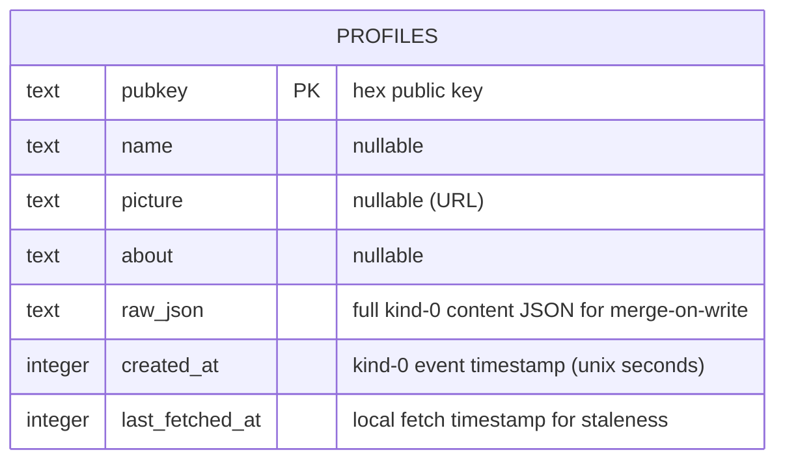

# Nostr Profile + Identity Package Extraction

## Overview

Extract the existing Nostr identity, signing, and relay infrastructure from `lib/nostr/` into a reusable Flutter package at `packages/nostr_identity/`. Simultaneously add kind-0 profile support (read + write) with persistent Drift caching, a profile editing screen in Settings, and leaderboard integration so players see real names instead of truncated npubs.

**Related brainstorm:** [2026-04-06-nostr-profile-package-brainstorm-doc.md](../brainstorm/2026-04-06-nostr-profile-package-brainstorm-doc.md)

---

## Problem Statement

1. **Anonymous leaderboards:** Players appear as `npub1abc...` everywhere. No names, pictures, or bios — limiting the social experience.
2. **No profile editing:** Users can generate/import a key but can't set a display name or avatar.
3. **Monolithic Nostr code:** All identity, signing, relay, and sharing logic is tightly coupled inside the app. Other Flutter developers can't reuse the Nostr identity infrastructure.

---

## Proposed Solution

A two-pronged approach: **extract** existing infrastructure into a package, then **build** profile support on top.

### Package Scope (`packages/nostr_identity/`)

| In package | Stays in app |
|---|---|
| Key management (generate, import, delete) | Game-specific event building (`EventBuilder`) |
| Signer abstraction + `LocalNostrSigner` | Community stats/leaderboard (kind 30042) |
| Profile metadata: kind-0 read/write (NIP-01) | Result sharing UI |
| Profile cache (Drift/SQLite) | Game cubits, views, routes |
| `NdkProvider` + relay config | `NostrIdentityCubit` (has app-level deletion dep) |
| Shared models (`NostrProfile`) | Identity setup views (app navigation) |

### Key Architectural Decisions

**1. Cubits stay in app; package exports repositories + models only.**
The `NostrIdentityCubit` depends on `NostrDeletionRepository` (an app-level concern for NIP-09 deletion of game results). Moving it to the package would create a circular dependency. The package provides data-layer building blocks; the app composes them into cubits.

**2. Read-then-merge for kind-0 writes.**
Kind-0 is replaceable and contains ALL profile fields as a JSON blob. When the user publishes an updated profile, the app must first read the existing kind-0 event (if any), merge v1 fields into the existing JSON, and publish the merged result. This prevents erasing fields set by other Nostr clients (e.g., `nip05`, `lud16`, `website`).

**3. Profile fetch orchestration: separate `ProfileCubit`.**
A new `ProfileCubit` in the app handles batch profile lookups. The `LeaderboardSection` widget composes `LeaderboardCubit` (scores) + `ProfileCubit` (names/avatars). This keeps the leaderboard cubit focused on scores and allows the profile system to be reused in Settings.

**4. Relay config is injectable.**
The package accepts relay URLs via constructor injection on `NdkProvider`, with the current VGG defaults as fallback. This makes the package usable by other apps.

**5. Drift schema versioning from day one.**
Start at schema version 1 with Drift's built-in migration support. When v2 adds `nip05`, `banner`, etc., migration callbacks handle the upgrade cleanly.

---

## Technical Approach

### Package Structure

```
packages/nostr_identity/
  lib/
    nostr_identity.dart              # barrel — public API only
    src/
      identity/
        nostr_identity_repository.dart   # key lifecycle (generate, import, delete, getSigner)
      signing/
        nostr_signer.dart                # abstract signer interface
        local_nostr_signer.dart          # Bip340 local signer
      profile/
        nostr_profile.dart               # model: name, picture, about + raw JSON
        nostr_profile_repository.dart    # kind-0 read/write + Drift cache
      database/
        nostr_database.dart              # Drift database definition (schema v1)
        nostr_database.g.dart            # generated
        profile_table.dart               # Drift table: pubkey, name, picture, about, rawJson, createdAt, lastFetchedAt
      relay/
        ndk_provider.dart                # shared NDK instance (injectable relays)
        relay_config.dart                # default relay URLs
  test/
    src/
      identity/
        nostr_identity_repository_test.dart
      signing/
        local_nostr_signer_test.dart
      profile/
        nostr_profile_test.dart
        nostr_profile_repository_test.dart
      database/
        nostr_database_test.dart
  pubspec.yaml                       # ndk, flutter_secure_storage, drift, sqlite3_flutter_libs, path_provider, equatable
  analysis_options.yaml              # very_good_analysis
```

### Data Model



### `NostrProfile` Model (`packages/nostr_identity/lib/src/profile/nostr_profile.dart`)

```dart
class NostrProfile extends Equatable {
  const NostrProfile({
    required this.pubkey,
    this.name,
    this.picture,
    this.about,
    this.rawJson,
    this.createdAt,
  });

  /// Parse from kind-0 event content JSON.
  factory NostrProfile.fromEvent(Nip01Event event);

  final String pubkey;       // hex
  final String? name;
  final String? picture;     // URL
  final String? about;
  final String? rawJson;     // preserved for merge-on-write
  final int? createdAt;

  /// Display name with fallback to truncated npub.
  String get displayName => name ?? _truncateNpub(pubkey);

  /// Merge v1 fields into rawJson, preserving unknown fields.
  Map<String, dynamic> toMergedJson({
    String? name,
    String? picture,
    String? about,
  });
}
```

### `NostrProfileRepository` (`packages/nostr_identity/lib/src/profile/nostr_profile_repository.dart`)

```dart
class NostrProfileRepository {
  NostrProfileRepository({
    required NdkProvider ndkProvider,
    required NostrDatabase database,
  });

  /// Fetch a single profile. Returns cached if fresh (< 24h), else queries relay.
  Future<NostrProfile?> getProfile(String pubkeyHex);

  /// Batch-fetch profiles. Cache-miss-only relay query.
  Future<Map<String, NostrProfile>> getProfiles(List<String> pubkeyHexList);

  /// Publish updated profile to relays. Reads existing kind-0 first and merges.
  Future<bool> publishProfile({
    required NostrSigner signer,
    required String pubkeyHex,
    String? name,
    String? picture,
    String? about,
  });

  /// Delete cached profile for a pubkey.
  Future<void> deleteProfile(String pubkeyHex);
}
```

### App Integration Changes

#### New: `ProfileCubit` (`lib/nostr/profile/cubit/profile_cubit.dart`)

```dart
class ProfileCubit extends Cubit<ProfileState> {
  ProfileCubit({required NostrProfileRepository profileRepository});

  /// Batch-fetch profiles for a list of pubkeys (e.g., leaderboard entries).
  Future<void> fetchProfiles(List<String> pubkeyHexList);

  /// Publish the current user's profile.
  Future<void> publishProfile({
    required String name,
    String? picture,
    String? about,
  });
}
```

#### New: Profile Editing Screen (`lib/settings/view/profile_edit_page.dart`)

Accessible from `NostrIdentitySection` when identity exists. Fields: name (required, max 100 chars), picture URL (optional, https only, max 2048 chars), about (optional, max 500 chars). Pre-populated from cached profile (or fetched on open).

#### Modified: `LeaderboardSection` (`lib/nostr/stats/view/leaderboard_section.dart`)

Compose with `ProfileCubit` to display `NostrProfile.displayName` and optional avatar instead of raw `entry.displayName` (truncated npub).

#### Modified: `NostrIdentityCubit` deletion flow

Add best-effort NIP-09 deletion of the user's kind-0 event alongside existing kind 30042 deletion. Clear the user's own profile from Drift cache.

#### Modified: Identity import flow

After a successful `importKey()`, trigger a fetch of the user's own kind-0 profile from relays so their existing profile (if any) appears immediately in Settings.

---

## Implementation Phases

### Phase 1: Package Scaffolding + Identity Extraction

**Goal:** Create `packages/nostr_identity/` and move existing identity/signing/relay code with zero behavior change.

**Tasks:**
- [ ] Create `packages/nostr_identity/` with `pubspec.yaml`, `analysis_options.yaml`, barrel file
- [ ] Move `lib/nostr/identity/repository/nostr_identity_repository.dart` → `packages/nostr_identity/lib/src/identity/`
- [ ] Move `lib/nostr/signing/nostr_signer.dart` + `local_nostr_signer.dart` → `packages/nostr_identity/lib/src/signing/`
- [ ] Move `lib/nostr/relay/ndk_provider.dart` + `relay_config.dart` → `packages/nostr_identity/lib/src/relay/`
- [ ] Make relay URLs injectable on `NdkProvider` constructor (keep VGG defaults)
- [ ] Update barrel file exports
- [ ] Add `nostr_identity` as path dependency in app `pubspec.yaml`
- [ ] Update all ~25 app import sites from `package:very_good_games/nostr/(identity|signing|relay)/...` to `package:nostr_identity/...`
- [ ] Move existing tests for identity/signing to `packages/nostr_identity/test/`
- [ ] Verify all existing tests pass with new imports
- [ ] Run `dart fix --apply` across both package and app

**Files created:**
- `packages/nostr_identity/pubspec.yaml`
- `packages/nostr_identity/analysis_options.yaml`
- `packages/nostr_identity/lib/nostr_identity.dart`
- `packages/nostr_identity/lib/src/identity/nostr_identity_repository.dart`
- `packages/nostr_identity/lib/src/signing/nostr_signer.dart`
- `packages/nostr_identity/lib/src/signing/local_nostr_signer.dart`
- `packages/nostr_identity/lib/src/relay/ndk_provider.dart`
- `packages/nostr_identity/lib/src/relay/relay_config.dart`
- `packages/nostr_identity/test/src/identity/nostr_identity_repository_test.dart`
- `packages/nostr_identity/test/src/signing/local_nostr_signer_test.dart`

**Files modified:**
- `pubspec.yaml` — add `nostr_identity` path dependency
- All ~25 files with `import 'package:very_good_games/nostr/(identity|signing|relay)/...'` — update imports
- `lib/nostr/identity/identity.dart` — barrel now re-exports from package (or removed if views re-organized)

**Files deleted:**
- `lib/nostr/identity/repository/nostr_identity_repository.dart`
- `lib/nostr/signing/nostr_signer.dart`, `local_nostr_signer.dart`, `signing.dart`
- `lib/nostr/relay/ndk_provider.dart`, `relay_config.dart`
- `test/nostr/identity/repository/nostr_identity_repository_test.dart`

**Success criteria:**
- [ ] All existing tests pass
- [ ] `dart analyze` clean in both package and app
- [ ] App runs identically to before extraction

---

### Phase 2: Drift Database + Profile Model

**Goal:** Add persistent profile caching with Drift and the `NostrProfile` model.

**Tasks:**
- [ ] Add `drift`, `sqlite3_flutter_libs`, `path_provider` dependencies to package `pubspec.yaml`
- [ ] Add `drift_dev`, `build_runner` to package `dev_dependencies`
- [ ] Create `NostrDatabase` Drift database class (`packages/nostr_identity/lib/src/database/nostr_database.dart`) at schema version 1
- [ ] Define `ProfileTable` with columns: `pubkey` (PK), `name`, `picture`, `about`, `rawJson`, `createdAt`, `lastFetchedAt`
- [ ] Run `dart run build_runner build` to generate Drift code
- [ ] Create `NostrProfile` model with `fromEvent()`, `displayName`, and `toMergedJson()` (`packages/nostr_identity/lib/src/profile/nostr_profile.dart`)
- [ ] Write unit tests for `NostrProfile` (construction, `fromEvent` parsing, `displayName` fallback, `toMergedJson` field preservation)
- [ ] Write unit tests for Drift database (upsert, query by pubkey, batch query, delete)

**Files created:**
- `packages/nostr_identity/lib/src/database/nostr_database.dart`
- `packages/nostr_identity/lib/src/database/nostr_database.g.dart` (generated)
- `packages/nostr_identity/lib/src/database/profile_table.dart`
- `packages/nostr_identity/lib/src/profile/nostr_profile.dart`
- `packages/nostr_identity/test/src/profile/nostr_profile_test.dart`
- `packages/nostr_identity/test/src/database/nostr_database_test.dart`

**Files modified:**
- `packages/nostr_identity/pubspec.yaml` — add drift deps
- `packages/nostr_identity/lib/nostr_identity.dart` — export new types

**Success criteria:**
- [ ] `NostrProfile.fromEvent()` correctly parses kind-0 JSON content
- [ ] `toMergedJson()` preserves unknown fields (e.g., `nip05`, `lud16`)
- [ ] `displayName` falls back to truncated npub when name is null
- [ ] Drift database creates, upserts, queries, and deletes profiles
- [ ] Schema version 1 migration callback exists (empty but present)

---

### Phase 3: Profile Repository (Read + Write)

**Goal:** Implement `NostrProfileRepository` — kind-0 relay queries, caching, and publish with read-then-merge.

**Tasks:**
- [ ] Create `NostrProfileRepository` (`packages/nostr_identity/lib/src/profile/nostr_profile_repository.dart`)
- [ ] Implement `getProfile(pubkeyHex)`: check Drift cache → if fresh (< 24h `lastFetchedAt`), return cached → else query relay kind-0, upsert cache, return
- [ ] Implement `getProfiles(pubkeyHexList)`: partition into cached (fresh) + stale/missing → batch relay query for missing (`authors: [list], kinds: [0]`) → upsert all → return map
- [ ] Implement `publishProfile(...)`: read existing kind-0 via `getProfile` → merge v1 fields into `rawJson` via `toMergedJson()` → sign → publish → upsert local cache
- [ ] Implement `deleteProfile(pubkeyHex)`: remove from Drift cache
- [ ] Relay timeout: 5 seconds (consistent with existing `CommunityStatsRepository`)
- [ ] Write unit tests with mocked NDK and in-memory Drift database
- [ ] Update barrel exports

**Files created:**
- `packages/nostr_identity/lib/src/profile/nostr_profile_repository.dart`
- `packages/nostr_identity/test/src/profile/nostr_profile_repository_test.dart`

**Files modified:**
- `packages/nostr_identity/lib/nostr_identity.dart` — export `NostrProfileRepository`

**Success criteria:**
- [ ] Cache-miss triggers relay query; cache-hit returns instantly
- [ ] Batch fetch queries only missing/stale pubkeys
- [ ] Publish merges existing kind-0 JSON, preserving unknown fields
- [ ] Relay timeout returns null (no exceptions bubbled)
- [ ] All test scenarios: cache hit, cache miss, stale refresh, publish success, publish failure, relay timeout

---

### Phase 4: App Integration — Profile Cubit + Leaderboard + Settings

**Goal:** Wire profiles into the app — leaderboard names/avatars, profile editing in Settings, identity lifecycle updates.

**Tasks:**

**Profile state management:**
- [ ] Create `ProfileCubit` + `ProfileState` (`lib/nostr/profile/cubit/profile_cubit.dart`, `profile_state.dart`)
- [ ] `fetchProfiles(List<String>)` → calls `NostrProfileRepository.getProfiles()`, emits profiles map
- [ ] `publishProfile(...)` → calls repository publish, emits updated state
- [ ] Write `bloc_test` tests for `ProfileCubit`

**Leaderboard integration:**
- [ ] Modify `LeaderboardSection` to compose `BlocBuilder<ProfileCubit, ProfileState>` alongside existing `BlocBuilder<LeaderboardCubit, LeaderboardState>`
- [ ] After leaderboard loads, trigger `ProfileCubit.fetchProfiles()` with entry pubkeys
- [ ] Replace `entry.displayName` (truncated npub) with `profile.displayName` (real name or npub fallback)
- [ ] Add optional `CircleAvatar` with profile picture (fallback: first letter of display name, or generic person icon)
- [ ] Update `_LeaderboardTable` column layout to accommodate avatar
- [ ] Write widget tests for leaderboard with profile data

**Profile editing:**
- [ ] Create `ProfileEditPage` widget (`lib/settings/view/profile_edit_page.dart`)
- [ ] Fields: name (required, max 100 chars), picture URL (optional, `https://` only, max 2048 chars), about (optional, max 500 chars)
- [ ] Pre-populate from cached profile (fetch on open if not cached)
- [ ] Save button → `ProfileCubit.publishProfile()` → success snackbar → pop
- [ ] Add route in `go_router` config
- [ ] Modify `NostrIdentitySection` to show "Edit Profile" option when identity exists
- [ ] Write widget tests for profile edit page (validation, save flow)

**Identity lifecycle updates:**
- [ ] After `importKey()` succeeds, trigger `NostrProfileRepository.getProfile(newPubkeyHex)` to fetch existing profile
- [ ] In `NostrIdentityCubit.deleteIdentity()`, add best-effort NIP-09 deletion of kind-0 event + `deleteProfile()` from Drift cache
- [ ] Update existing identity cubit tests for new deletion behavior

**Wiring:**
- [ ] Initialize `NostrDatabase` in `main.dart`
- [ ] Create `NostrProfileRepository` in `main.dart`, provide via `MultiRepositoryProvider` in `App`
- [ ] Provide `ProfileCubit` at game page level (alongside `LeaderboardCubit`)
- [ ] Update `App` constructor to accept `NostrProfileRepository`

**Files created:**
- `lib/nostr/profile/cubit/profile_cubit.dart`
- `lib/nostr/profile/cubit/profile_state.dart`
- `lib/nostr/profile/profile.dart` (barrel)
- `lib/settings/view/profile_edit_page.dart`
- `test/nostr/profile/cubit/profile_cubit_test.dart`
- `test/settings/view/profile_edit_page_test.dart`
- `test/nostr/stats/view/leaderboard_section_with_profiles_test.dart`

**Files modified:**
- `lib/nostr/stats/view/leaderboard_section.dart` — profile composition + avatar
- `lib/settings/view/widgets/nostr_identity_section.dart` — add "Edit Profile" action
- `lib/nostr/identity/cubit/nostr_identity_cubit.dart` — kind-0 deletion on delete
- `lib/app/app.dart` — add `NostrProfileRepository` to `MultiRepositoryProvider`
- `lib/main.dart` — initialize `NostrDatabase`, create `NostrProfileRepository`
- `lib/games/guess_the_number/view/game_page.dart` — provide `ProfileCubit`
- `lib/games/signal/view/signal_page.dart` — provide `ProfileCubit`
- `lib/app/routes/routes.dart` — add profile edit route
- `test/nostr/identity/cubit/nostr_identity_cubit_test.dart` — update for kind-0 deletion

**Success criteria:**
- [ ] Leaderboard shows real names for users with profiles, truncated npub for others
- [ ] Profile editing saves to relays and updates local cache
- [ ] Importing an existing key fetches and displays the existing profile
- [ ] Identity deletion removes kind-0 from relays (best-effort) and clears local cache
- [ ] All new and existing tests pass

---

## Acceptance Criteria

### Functional Requirements

- [ ] `packages/nostr_identity/` is a valid Flutter package with `very_good_analysis`
- [ ] Existing identity/signing/relay code moved with zero behavior change
- [ ] All app imports updated from `package:very_good_games/nostr/...` to `package:nostr_identity/...`
- [ ] Users can set name, picture URL, and about in a profile editing screen
- [ ] Profile publishes as a kind-0 event to default relays
- [ ] Kind-0 write preserves unknown fields from existing profile (read-then-merge)
- [ ] Leaderboard displays profile names instead of truncated npubs where available
- [ ] Profiles cached in Drift/SQLite with 24-hour staleness policy
- [ ] Cached profiles display instantly on app relaunch (no relay roundtrip)
- [ ] Batch profile fetch queries only cache-miss pubkeys
- [ ] Profile fetch failure falls back to truncated npub (no error UI)
- [ ] Identity deletion attempts NIP-09 deletion of kind-0 event
- [ ] Importing an existing key auto-fetches the user's existing profile

### Non-Functional Requirements

- [ ] Relay timeout: 5 seconds (consistent with existing patterns)
- [ ] Profile field validation: name max 100 chars, about max 500 chars, picture URL `https://` + max 2048 chars
- [ ] No new lint warnings (`dart analyze` clean in both package and app)
- [ ] Package has no dependency on app code (one-way dependency: app → package)

### Quality Gates

- [ ] Unit tests for all package code (repository, model, database, signer)
- [ ] `bloc_test` tests for `ProfileCubit`
- [ ] Widget tests for `ProfileEditPage` and updated `LeaderboardSection`
- [ ] Existing tests updated for import path changes and new deletion behavior
- [ ] `CLAUDE.md` updated with package conventions and profile patterns

---

## Dependencies & Prerequisites

| Dependency | Type | Notes |
|---|---|---|
| `drift` + `drift_dev` + `build_runner` | New package dep | Persistent profile cache |
| `sqlite3_flutter_libs` | New package dep | SQLite binaries for iOS/Android/macOS |
| `path_provider` | New package dep | Database file path resolution |
| `ndk` | Moved from app | Already in use; moves to package pubspec |
| `flutter_secure_storage` | Moved from app | Already in use; moves to package pubspec |
| `equatable` | Moved from app | Already in use for models |

**Phase dependencies:** Phase 1 → Phase 2 → Phase 3 → Phase 4 (sequential; each builds on prior).

---

## Risk Analysis & Mitigation

| Risk | Impact | Mitigation |
|---|---|---|
| Import migration breaks existing functionality | High | Run full test suite after each import batch; commit extraction as isolated step |
| Kind-0 write erases fields from other clients | High | Read-then-merge pattern; preserve `rawJson` in model and Drift cache |
| Drift adds significant binary size | Medium | `sqlite3_flutter_libs` is ~2MB; acceptable for persistent caching benefit |
| Profile fetch slows leaderboard display | Medium | Show leaderboard immediately with truncated npubs; profiles update asynchronously |
| Relay timeout for profile queries blocks UI | Low | 5s timeout; cache-first approach; fallback to truncated npub |
| Drift schema migration complexity in v2 | Low | Schema version 1 with migration callback from day one |

---

## Alternative Approaches Considered

**1. In-memory profile cache (no Drift)**
Rejected: Profiles would be lost on app restart, requiring relay queries on every launch. Drift enables instant display of cached profiles.

**2. Move cubits into the package**
Rejected: `NostrIdentityCubit` depends on `NostrDeletionRepository` (app-level game result deletion). Moving it would create circular dependencies. Repositories in package, cubits in app is cleaner.

**3. Separate `db_client` package (divine-mobile pattern)**
Rejected for v1: divine-mobile's `db_client` package is shared across multiple feature packages. VGG has only one database consumer. A single Drift database inside `nostr_identity` is simpler. Can extract later if needed.

**4. Profile fetching inside `LeaderboardCubit`**
Rejected: Couples leaderboard to profile concerns. Separate `ProfileCubit` allows reuse in Settings and other screens.

---

## Future Considerations

- **NIP-05 verification** (`nip05` field in kind-0) — display verified identity badges
- **NIP-96 image upload** — in-app profile picture capture + upload to nostr.build
- **NIP-46 bunker signing** — signer abstraction already supports this; add `BunkerNostrSigner`
- **NIP-65 relay discovery** — per-user relay preferences instead of hardcoded defaults
- **Additional profile fields** — `display_name`, `banner`, `website`, `lud16` (Drift migration to v2)
- **Profile cache eviction** — `lastAccessedAt` column + LRU eviction after N months
- **Package publishing** — publish `nostr_identity` to pub.dev when API stabilizes
- **Package widgets** — extract reusable profile display widgets from app into package

---

## Documentation Plan

- [ ] Update `CLAUDE.md` with:
  - Package location and dependency direction (`app → packages/nostr_identity`)
  - Profile-related conventions (read-then-merge, field validation, cache staleness)
  - How to add new profile fields (Drift migration)
- [ ] Add `packages/nostr_identity/README.md` with usage examples

---

## References & Research

### Internal References

- Existing identity repository: `lib/nostr/identity/repository/nostr_identity_repository.dart`
- Signer abstraction: `lib/nostr/signing/nostr_signer.dart`
- NDK provider: `lib/nostr/relay/ndk_provider.dart`
- Leaderboard display name (truncated npub): `lib/nostr/stats/models/leaderboard.dart:27`
- Settings identity section: `lib/settings/view/widgets/nostr_identity_section.dart`
- App wiring: `lib/main.dart`, `lib/app/app.dart`
- Divine-mobile profile reference: `/Users/john/AndroidStudioProjects/divine-mobile/mobile/packages/profile_repository/`

### Protocol References

- NIP-01 (Kind 0 — User Metadata): replaceable event, content is stringified JSON with `name`, `picture`, `about`
- NIP-09 (Event Deletion): used for best-effort kind-0 deletion on identity delete
- NIP-32 (Labeling): used by existing kind 30042 score events (not changed by this feature)
